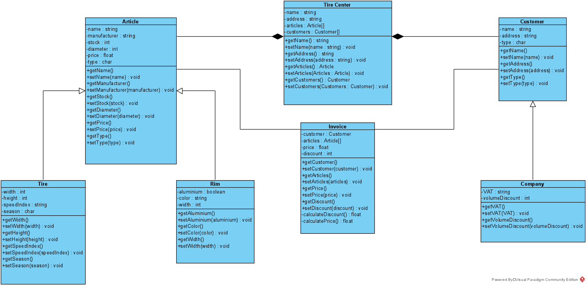

# Object Oriented Programming: Tirecenter

Project focused on C++ OOP about a tire center.

## Preperation

> This isn't necessary to fill, purely style points :)

Enter a name and address of your tirecenter in `data/tirecenter.dat` with the format:
```
name
address
```
e.g.:
```
De Nayer
Jan De Nayerlaan 5, 2860 Sint-Katelijne-Waver
```

## Build & running

Running natively:  
```shell
make release run
```

Other commands:
```shell
make clean release run
make run
make debug
```

For a good experience make your terminal large enough to comfortably fit all the output.

## TODO

- [X] Use cases to finish
  - [X] Filter tires/rims
  - [X] Update stock?
- [X] Invoice calc discount etc
  - [X] fix discount
- [X] Lookup invoice per customer
- [X] Loading and saving
  - [X] Articles
  - [X] Customers
  - [X] Invoices (has to be fixed)
  - [X] Tirecenter (optionally)
- [X] Error handling
  - [X] ~~Wrong input types~~ -> not necessary
- [ ] Make functions for reading lines (low priority)
- [X] Proper exit and back options in menus
- [ ] Styling (low priority)
  - [ ] Coloring
  - [X] Spacing
- [X] Minimize warnings
- [X] Abstract article class
- [X] Clean up parameters in actions (full tirecenter not necessary)
- [X] convert to `nullptr`
- [X] fix customer constructor
- [X] Split up actions into header and cpp
- [ ] Convert files to lowercase
- [X] Delete all pointers in tirecenter/invoices deconstructor




## Project info

>- [X] De bandencentrale verkoopt banden en velgen in verschillende maten. Ze hebben hiervan een kleine stock, die ze graag met het programma zouden beheren. Ook willen ze de klanten in dit programma bijhouden en willen ze van elke klant weten welke banden en/of velgen deze gekocht hebben.  

Je kan articles zoeken en filteren, hierbij wordt stock weergeven. De stock kan je updaten met `change article`.

>- [ ] Het programma moet de stock kunnen weergeven van alle banden en velgen die er verkocht worden. Ook indien ze niet voorradig zijn moeten deze weergegeven worden. De stock moet volledig kunnen weergegeven worden, maar er moet ook kunnen gefilterd worden op banden of velgen. Ook hadden ze graag kunnen filteren op maat.

`Search articles` heeft filter opties op diameter, samen met een keyword search functie.
Stock wordt weergeven samen met de rest van het article eigenschappen.

>- [X] Banden worden verkocht per stuk of per set van 2 of 4 stuks, velgen steeds in sets van 4. Wanneer een medewerker de totale order van een klant heeft afgewerkt wordt deze stock geüpdate en wordt een factuur gemaakt met de prijs van de artikelen, de totaalprijs en de verkregen korting.

`calculateDiscount` houdt rekening met de sets en het soort klant en berekent met sets de korting. De invoice, of factuur toont de prijs, korting en totaal prijs, samen met de articles apart. De stock wordt geüpdate wanneer het factuur wordt aangemaakt.

>- [X] Alle artikelen hebben een aantal vaste kenmerken, zoals een fabrikant, een naam en een diameter. Banden hebben als extra kenmerken een breedte en hoogte (in mm), een snelheidsindex (letter) en een seizoensaanduiding. Velgen hebben een breedte (in inch) en een kleur en zijn van staal of aluminium.

>- [X] Ook worden de klanten bijgehouden in het systeem. Er wordt een opsplitsing gemaakt tussen particuliere klanten en bedrijfsklanten.

>- [X] Zo krijgen bedrijfsklanten een andere prijs te zien dan particuliere klanten en kunnen ze een extra korting krijgen bij de aankoop vanaf 10 sets. Particuliere klanten krijgen een korting bij aankoop van een set van vier banden en extra korting bij de aankoop van een bijpassende set velgen.

`calculateDiscount` houdt rekening met de sets en het soort klant.

>- [X] Elke opgemaakte factuur moet aan een klant gelinkt kunnen worden. De eigenaar en een medewerker moeten met het systeem kunnen werken. 

De facturen maken een kopie van de klant (en articles) en tonen de naam in de print functie van een factuur.
Het zal dus altijd gelinkt kunnen worden aan een klant.

>- [X] De eigenaar moet nieuwe artikels kunnen toevoegen en artikels kunnen verwijderen. Beide moeten in staat zijn om artikels te kunnen bekijken en filteren.

Permissies worden zijn per usertype en kunnen makkelijk aangepast worden door acties toe te voegen of te verwijderen.  
Zo krijgt de eigenaar andere rechten dan de werknemer:
```cpp
const std::vector<Actions> userPermissions[] {

        {
            Actions::EXIT, Actions::BACK,
            Actions::A_ADD, Actions::A_DELETE, Actions::A_CHANGE, Actions::A_SEARCH,
            Actions::C_ADD, Actions::C_DELETE, Actions::C_CHANGE, Actions::C_SEARCH, 
            Actions::O_PLACE, Actions::I_SEARCH,
        },

        {
            Actions::EXIT, Actions::BACK,
            Actions::A_CHANGE, Actions::A_SEARCH,
            Actions::C_ADD, Actions::C_CHANGE, Actions::C_SEARCH, 
            Actions::O_PLACE, Actions::I_SEARCH,
        }
};
```

>- [X] Ook moeten zowel eigenaar als medewerker klanten kunnen toevoegen en bekijken en moeten ze per klant de facturen kunnen opvragen.

Check invoices heeft een optie om alle facturen te tonen of van een specifieke klant.

>- [X] Enkel de eigenaar moet in staat zijn om een klant te verwijderen (de bijhorende facturen moeten in het systeem aanwezig blijven).

Facturen maken een kopie van de klant en artikelen. Ze worden zo in een bestand opgeslagen en blijven dus aanwezig. Aangezien het een kopie is maakt het niet uit wanneer een klant verwijderd wordt.
